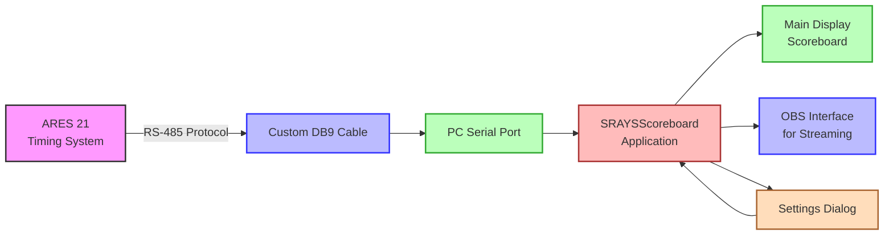

# SRAYSScoreboard

A Windows application that displays real-time swimming competition data from the Omega ARES 21 timing system. This scoreboard display is optimized for a ten-lane pool and provides a clean, easy-to-read interface for spectators and officials.

## Overview

SRAYSScoreboard was developed by Silver Rays Swim Club to provide a simple, reliable way to display swimming competition data from the Omega ARES 21 timing system. The application connects to the timing system via a serial port and displays:

- Event name and number
- Running time
- Swimmer names
- Finishing places
- Swimmer times



The application is designed to be displayed on a secondary monitor or projector for spectators to view during swim meets. It also includes a dedicated interface for Open Broadcaster Software (OBS) integration, allowing for easy streaming of competition data.

## System Requirements

- Windows operating system (Windows 7 or newer)
- .NET Framework 4.7.2 or higher
- Available serial port (COM port) for connection to the Omega ARES 21 timing system
- Display with resolution of at least 1024x768 (higher resolution recommended)

## Installation

1. Download the latest release from the [Releases](https://github.com/fvishram/SRAYSScoreboard/releases) page
2. Extract the ZIP file to a location of your choice
3. Run `SRAYSScoreboard.exe` to start the application

Alternatively, you can build the application from source:

1. Clone this repository
2. Open `SRAYSScoreboard.sln` in Visual Studio (2017 or newer recommended)
3. Build the solution (Ctrl+Shift+B)
4. Run the application (F5)

## Configuration

### Timing System Setup

Before using SRAYSScoreboard, you must configure your Omega ARES 21 timing system:

1. Set the ARES system to output in Venus ERTD scoreboard format
2. Connect the ARES system to your computer using a custom serial cable with RS-485 protocol
   - Note: If your computer doesn't have a serial port, you will need a USB 2.0 to RS-485 adapter (not a standard USB-to-Serial adapter)
   - A custom DB9 cable with different pinouts on each end is required:
     
     #### DB9 Connector Pin Numbering

     ```mermaid
     graph TB
         subgraph "DB9 Female Connector (PC Side)"
             direction TB
             F1["Pin 1"] --- F2["Pin 2"] --- F3["Pin 3"] --- F4["Pin 4"] --- F5["Pin 5"]
             F6["Pin 6"] --- F7["Pin 7"] --- F8["Pin 8"] --- F9["Pin 9"]
             
             F1 -.- FT1["T(+)/RS-485 B(+)"]
             F2 -.- FT2["T(-)/RS-485 A(-)"]
             F5 -.- FT5["Ground"]
             
             style F1 fill:#bbf,stroke:#33f,stroke-width:2px
             style F2 fill:#fbb,stroke:#f33,stroke-width:2px
             style F5 fill:#bbb,stroke:#333,stroke-width:2px
         end
         
         subgraph "DB9 Male Connector (ARES Side)"
             direction TB
             M1["Pin 1"] --- M2["Pin 2"] --- M3["Pin 3"] --- M4["Pin 4"] --- M5["Pin 5"]
             M6["Pin 6"] --- M7["Pin 7"] --- M8["Pin 8"] --- M9["Pin 9"]
             
             M3 -.- MT3["T(-)/RS-485 A(-)"]
             M4 -.- MT4["T(+)/RS-485 B(+)"]
             M7 -.- MT7["Ground"]
             
             style M3 fill:#fbb,stroke:#f33,stroke-width:2px
             style M4 fill:#bbf,stroke:#33f,stroke-width:2px
             style M7 fill:#bbb,stroke:#333,stroke-width:2px
         end
     ```
     
     **PC Side (DB9 Female):**
     | DB9 Pin | Function      |
     |---------|---------------|
     | 1       | T(+) / RS-485 B(+) |
     | 2       | T(-) / RS-485 A(-) |
     | 5       | Ground        |
     | 3,4,6,7,8,9 | Not connected |
     
     **ARES Timing Console Side (DB9 Male):**
     | DB9 Pin | Function      |
     |---------|---------------|
     | 3       | T(-) / RS-485 A(-) |
     | 4       | T(+) / RS-485 B(+) |
     | 7       | Ground        |
     | 1,2,5,6,8,9 | Not connected |

### Application Setup

1. Launch SRAYSScoreboard
2. Access the settings dialog in one of two ways:
   - Press F2 on your keyboard, or
   - Right-click on the scoreboard and select "Settings" from the context menu
3. In the Connection tab, select your COM port from the dropdown list
4. Optionally, configure colors and pool lane count in the other tabs
5. Click "OK" to save the settings

## Usage

1. Start the application before the beginning of the swim meet
2. The application will automatically display data as it is received from the timing system
3. The display will update in real-time as events progress
4. To exit the application, click on "File" > "Exit" in the menu bar or press Escape

## Features

- Real-time display of swimming competition data
- Support for both 8-lane and 10-lane pool configurations
- Comprehensive settings dialog with tabbed interface
- Customizable colors for all display elements
- Pool configuration options (8 or 10 lanes)
- Easy COM port selection with dropdown list
- Dedicated OBS interface for live streaming
- Automatic saving and loading of user preferences
- Comprehensive error handling and connection management
- Keyboard shortcuts (F2 for settings, Escape to exit)

## Troubleshooting

For common issues and their solutions, please see the [Troubleshooting Guide](docs/TROUBLESHOOTING.md).

For more detailed information about specific aspects of the application, refer to:

- [Protocol Documentation](docs/PROTOCOL.md) - Details about the Venus ERTD protocol
- [Customization Guide](docs/CUSTOMIZATION.md) - How to customize the appearance and behavior
- [Architecture Overview](docs/ARCHITECTURE.md) - Technical details about the application structure

## Development

SRAYSScoreboard is written in C# using Windows Forms. The main components are:

- `Scoreboard.cs`: The main form that displays the scoreboard interface
- `AresDataHandler.cs`: Processes the data received from the timing system
- `Settings.cs`: Handles the configuration dialog with tabbed interface
- `OBSScoreboard.cs`: Provides a streamlined interface for OBS capture

### Data Format

The application expects data in the Venus ERTD format from the Omega ARES 21 timing system. The data is parsed according to specific header codes that identify different types of information (event name, running time, swimmer names, results).

## Contributing

Contributions to improve SRAYSScoreboard are welcome! Here's how you can contribute:

1. Fork the repository
2. Create a feature branch (`git checkout -b feature/your-feature-name`)
3. Make your changes
4. Commit your changes (`git commit -m 'Add some feature'`)
5. Push to the branch (`git push origin feature/your-feature-name`)
6. Create a new Pull Request

## License

This project is licensed under the MIT License - see the [LICENSE.txt](LICENSE.txt) file for details.

## Acknowledgments

- Silver Rays Swim Club for supporting the development of this application
- Omega for their timing system documentation
- All contributors who have helped improve this project

## Contact

For questions or support, please open an issue on the [GitHub repository](https://github.com/fvishram/SRAYSScoreboard/issues).
