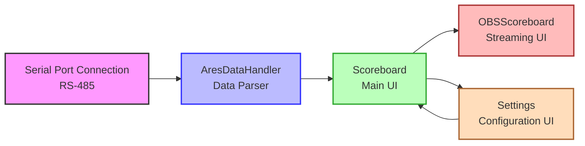

# SRAYSScoreboard Architecture

This document provides a technical overview of the SRAYSScoreboard application architecture, explaining how the various components work together to display real-time swimming competition data.

## Component Overview

SRAYSScoreboard consists of several key components that work together:

The diagram above shows the data flow between the main components of the application.

### Main Components

1. **Serial Port Connection**: Handles communication with the Omega ARES 21 timing system using the RS-485 protocol (requires a USB 2.0 to RS-485 adapter if no native serial port is available)
2. **AresDataHandler**: Processes and parses the data received from the timing system
3. **Scoreboard Form**: The main user interface that displays the scoreboard data
4. **OBSScoreboard Form**: A secondary interface optimized for streaming with OBS
5. **Settings Form**: A tabbed dialog for configuring the application, including COM port selection, color customization, and pool lane configuration

## Data Flow

1. The Omega ARES 21 timing system sends data via a serial connection using the RS-485 protocol
2. The application receives this data through the SerialPort component
3. The `serialPort_DataReceived` event handler is triggered when data arrives
4. The received data is passed to the AresDataHandler for processing
5. The AresDataHandler parses the data according to the Venus ERTD protocol
6. The parsed data is stored in the AresDataHandler's properties
7. The UI is updated to display the new data via the `SafeUpdateScoreboard` method
8. If the OBSScoreboard is active, it also updates based on the same data

## Class Descriptions

### AresDataHandler

The core data processing class that:
- Implements a state machine to parse the Venus ERTD protocol
- Stores the current state of the scoreboard data
- Provides properties to access the parsed data

Key methods:
- `processInput(char data)`: Processes a single character from the input stream
- `processInput(char[] data)`: Processes an array of characters
- `processName(int lane, string data)`: Processes swimmer name data
- `processResults(int lane, string data)`: Processes result data (place and time)

### Scoreboard

The main form that:
- Displays the scoreboard interface
- Handles the serial port connection
- Provides user interface for settings and customization
- Updates the display with data from the AresDataHandler

Key methods:
- `SafeUpdateScoreboard()`: Updates the UI with the latest data, ensuring thread safety
- `ApplySettings(Settings formSettings)`: Applies settings from the Settings form
- Various color customization methods
- Context menu handlers for settings and customization

### OBSScoreboard

A secondary form optimized for OBS capture that:
- Provides a streamlined interface for broadcasting
- Shares the same data source as the main scoreboard
- Updates automatically when the main scoreboard receives new data
- Inherits settings from the main scoreboard

### Settings

A tabbed dialog form that:
- Provides a centralized interface for application configuration
- Allows COM port selection with a dropdown list and refresh option
- Automatically recommends COM5 as the default timing system port
- Offers comprehensive color customization for all UI elements:
  - Background color
  - Header labels color (event name, running time)
  - Column headers color (Lane, Name, Place, Time)
  - Name labels color
  - Time labels color
  - Place labels color
  - Lane labels color
- Enables configuration of pool lanes (8 or 10)

Key methods:
- `LoadSettings()`: Loads saved settings from application properties
- `PopulateComPorts()`: Populates the COM port dropdown with available ports
- Various color customization methods

## Threading Model

The application uses a multi-threaded approach:
- The main UI runs on the primary thread
- Serial port data is received on a background thread
- UI updates are marshaled back to the UI thread using `Invoke` when necessary

This ensures that the UI remains responsive even when processing large amounts of data from the timing system.

## Settings Management

The application uses the .NET Settings framework to persist user preferences:
- COM port settings
- Color customization options (background, text, and individual element colors)
- Pool lane configuration (8 or 10 lanes)
- Window positions and sizes

Settings are managed through both:
- The dedicated Settings dialog with a tabbed interface
- Context menu options for quick access to common settings

All settings are automatically saved when changed and loaded when the application starts.

## Error Handling

The application implements error handling in several key areas:
- Serial port connection errors are caught and reported to the user
- Data parsing errors are handled gracefully to prevent application crashes
- UI update errors are managed through the thread-safe invocation pattern

## Extensibility Points

The architecture allows for several extension points:
- Additional data types can be supported by adding new header code handlers in AresDataHandler
- The UI can be extended with additional visualization options
- Support for different timing systems could be added by implementing alternative data handlers

## Performance Considerations

- The application is designed to handle real-time data with minimal latency
- The parsing algorithm is optimized for the specific protocol format
- UI updates are batched where possible to reduce overhead
- The OBSScoreboard is designed to be lightweight for streaming scenarios
