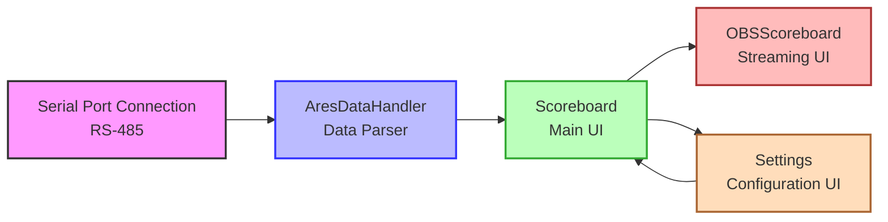
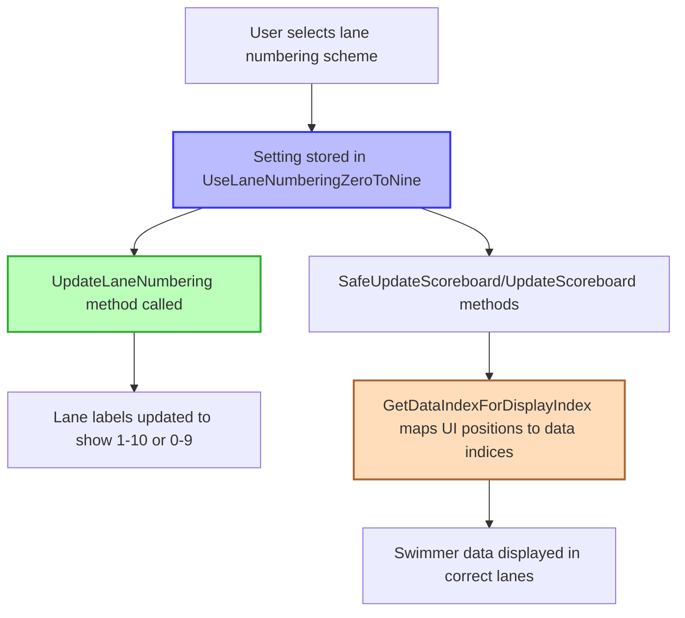

# SRAYSScoreboard Architecture

This document provides a technical overview of the SRAYSScoreboard application architecture, explaining how the various components work together to display real-time swimming competition data.

## Component Overview

SRAYSScoreboard consists of several key components that work together:



The diagram above shows the data flow between the main components of the application.

### Main Components

1. **Serial Port Connection**: Handles communication with the Omega ARES 21 timing system using the RS-485 protocol (requires a USB 2.0 to RS-485 adapter if no native serial port is available)
2. **AresDataHandler**: Processes and parses the data received from the timing system
3. **Scoreboard Form**: The main user interface that displays the scoreboard data
4. **OBSScoreboard Form**: A secondary interface optimized for streaming with OBS
5. **Settings Form**: A tabbed dialog for configuring the application, including COM port selection, color customization, and pool lane configuration

## Data Flow

1. The Omega ARES 21 timing system sends data via a serial connection using the RS-485 protocol
2. The application receives this data through the SerialPort component
3. The `serialPort_DataReceived` event handler is triggered when data arrives
4. The received data is passed to the AresDataHandler for processing
5. The AresDataHandler parses the data according to the Venus ERTD protocol
6. The parsed data is stored in the AresDataHandler's properties
7. The UI is updated to display the new data via the `SafeUpdateScoreboard` method
8. If the OBSScoreboard is active, it also updates based on the same data

## Class Descriptions

### AresDataHandler

The core data processing class that:
- Implements a state machine to parse the Venus ERTD protocol
- Stores the current state of the scoreboard data
- Provides properties to access the parsed data

Key methods:
- `processInput(char data)`: Processes a single character from the input stream
- `processInput(char[] data)`: Processes an array of characters
- `processName(int lane, string data)`: Processes swimmer name data
- `processResults(int lane, string data)`: Processes result data (place and time)

### Scoreboard

The main form that:
- Displays the scoreboard interface
- Handles the serial port connection
- Provides user interface for settings and customization
- Updates the display with data from the AresDataHandler

Key methods:
- `SafeUpdateScoreboard()`: Updates the UI with the latest data, ensuring thread safety
- `ApplySettings(Settings formSettings)`: Applies settings from the Settings form
- Various color customization methods
- Keyboard shortcuts for settings (F2) and application exit (Escape)

### OBSScoreboard

A secondary form optimized for OBS capture that:
- Provides a streamlined interface for broadcasting
- Shares the same data source as the main scoreboard
- Updates automatically when the main scoreboard receives new data
- Inherits settings from the main scoreboard

### Settings

A tabbed dialog form that:
- Provides a centralized interface for application configuration
- Allows COM port selection with a dropdown list and refresh option
- Automatically recommends COM5 as the default timing system port
- Offers comprehensive color customization for all UI elements:
  - Background color
  - Header labels color (event name, running time)
  - Column headers color (Lane, Name, Place, Time)
  - Name labels color
  - Time labels color
  - Place labels color
  - Lane labels color
- Enables configuration of pool lanes (8 or 10)
- Provides option to switch between standard lane numbering (1-10) and alternative lane numbering (0-9)

Key methods:
- `LoadSettings()`: Loads saved settings from application properties
- `PopulateComPorts()`: Populates the COM port dropdown with available ports
- Various color customization methods

## Threading Model

The application uses a multi-threaded approach:
- The main UI runs on the primary thread
- Serial port data is received on a background thread
- UI updates are marshaled back to the UI thread using `Invoke` when necessary

This ensures that the UI remains responsive even when processing large amounts of data from the timing system.

## Settings Management

The application uses the .NET Settings framework to persist user preferences:
- COM port settings
- Color customization options (background, text, and individual element colors)
- Pool lane configuration (8 or 10 lanes)
- Lane numbering configuration (1-10 or 0-9)
- Window positions and sizes

Settings are managed through the dedicated Settings dialog with a tabbed interface, which can be accessed by pressing F2.

All settings are automatically saved when changed and loaded when the application starts.

## Error Handling

The application implements error handling in several key areas:
- Serial port connection errors are caught and reported to the user
- Data parsing errors are handled gracefully to prevent application crashes
- UI update errors are managed through the thread-safe invocation pattern

## Extensibility Points

The architecture allows for several extension points:
- Additional data types can be supported by adding new header code handlers in AresDataHandler
- The UI can be extended with additional visualization options
- Support for different timing systems could be added by implementing alternative data handlers

## Lane Numbering Implementation

The application supports two lane numbering schemes:

1. **Standard (1-10)**: Traditional lane numbering from 1 to 10
2. **Alternative (0-9)**: Zero-based lane numbering from 0 to 9

This feature is implemented as follows:



### Key Implementation Details

1. **Data Storage**: The AresDataHandler always processes and stores data using 1-10 lane numbering internally. The arrays that store swimmer data (swimmerNames, swimmerPlaces, swimmerTimes) are 0-indexed, with indices 0-9 corresponding to lanes 1-10.

2. **UI Display**: When the lane numbering setting is changed, the `UpdateLaneNumbering()` method updates the lane number labels in the UI to display either 1-10 or 0-9.

3. **Data Mapping**: The critical component is the `GetDataIndexForDisplayIndex()` method, which maps UI display positions to the correct data indices:
   - For standard 1-10 numbering: The display index directly maps to the data index
   - For alternative 0-9 numbering: 
     - Lane 0 in the UI shows data for lane 10 (index 9)
     - Lanes 1-9 in the UI show data for lanes 1-9 (indices 0-8)

4. **Consistency**: This mapping is implemented consistently in both the main Scoreboard and the OBSScoreboard to ensure that data is displayed correctly in both interfaces.

This approach allows the application to maintain a consistent internal data model while providing flexible display options for different competition requirements.

## Performance Considerations

- The application is designed to handle real-time data with minimal latency
- The parsing algorithm is optimized for the specific protocol format
- UI updates are batched where possible to reduce overhead
- The OBSScoreboard is designed to be lightweight for streaming scenarios

## UI Development with VSCode

This section provides guidance for developers maintaining and enhancing the application's UI using VSCode, including how to directly modify the designer.cs files when necessary.

### Understanding Designer.cs Files

The `.Designer.cs` files are auto-generated by Visual Studio's Windows Forms designer but can be manually edited in VSCode with proper understanding of their structure:

```
namespace SRAYSScoreboard
{
    partial class Scoreboard
    {
        // Designer variables
        private System.ComponentModel.IContainer components = null;
        
        // Dispose method
        protected override void Dispose(bool disposing) { ... }
        
        // InitializeComponent method
        private void InitializeComponent()
        {
            // Component initialization
            // Control creation and property setting
            // Event handler wiring
            // Layout configuration
        }
        
        // Control declarations
        private System.Windows.Forms.Label labelTime;
        private System.Windows.Forms.TableLayoutPanel tableLayoutPanel1;
        // ... more controls
    }
}
```

### Directly Modifying Designer.cs Files

When working in VSCode, you can directly edit the designer files by following these patterns:

#### 1. Adding New Controls

To add a new control (e.g., a label):

1. **Add the control declaration** at the bottom of the file with other control declarations:

```csharp
private System.Windows.Forms.Label labelNewFeature;
```

2. **Initialize the control** in the `InitializeComponent()` method:

```csharp
this.labelNewFeature = new System.Windows.Forms.Label();
```

3. **Configure the control properties**:

```csharp
// Set basic properties
this.labelNewFeature.AutoSize = true;
this.labelNewFeature.Font = new System.Drawing.Font("Microsoft Sans Serif", 26.25F, System.Drawing.FontStyle.Bold, System.Drawing.GraphicsUnit.Point, ((byte)(0)));
this.labelNewFeature.ForeColor = System.Drawing.Color.LightSteelBlue;
this.labelNewFeature.Location = new System.Drawing.Point(161, 935);
this.labelNewFeature.Name = "labelNewFeature";
this.labelNewFeature.Size = new System.Drawing.Size(154, 39);
this.labelNewFeature.TabIndex = 32;
this.labelNewFeature.Text = "New Feature";
```

4. **Add the control to its container** (e.g., form or panel):

```csharp
this.tableLayoutPanel1.Controls.Add(this.labelNewFeature, 1, 11);
// Or for direct form controls:
this.Controls.Add(this.labelNewFeature);
```

5. **Wire up any event handlers** if needed:

```csharp
this.labelNewFeature.Click += new System.EventHandler(this.labelNewFeature_Click);
```

#### 2. Modifying Existing Controls

To modify an existing control:

1. **Locate the control's initialization** in the `InitializeComponent()` method
2. **Update the properties** as needed, following the existing pattern:

```csharp
// Original
this.labelTime.Text = "Time";

// Modified
this.labelTime.Text = "Race Time";
this.labelTime.Font = new System.Drawing.Font("Arial", 36F, System.Drawing.FontStyle.Bold, System.Drawing.GraphicsUnit.Point, ((byte)(0)));
```

#### 3. Removing Controls

To remove a control:

1. **Remove all references** to the control in the `InitializeComponent()` method
2. **Remove the control declaration** from the bottom of the file
3. **Remove any event handlers** in the main `.cs` file that reference this control

#### 4. Working with TableLayoutPanel

The application uses TableLayoutPanel extensively. When modifying it:

1. **Understand the column and row structure**:

```csharp
// Column configuration
this.tableLayoutPanel1.ColumnCount = 4;
this.tableLayoutPanel1.ColumnStyles.Add(new System.Windows.Forms.ColumnStyle(System.Windows.Forms.SizeType.Percent, 8.448695F));
// ... more columns

// Row configuration
this.tableLayoutPanel1.RowCount = 11;
this.tableLayoutPanel1.RowStyles.Add(new System.Windows.Forms.RowStyle(System.Windows.Forms.SizeType.Percent, 9.090908F));
// ... more rows
```

2. **Add controls to specific cells** using column and row indices:

```csharp
this.tableLayoutPanel1.Controls.Add(this.labelNewFeature, 1, 11); // Column 1, Row 11
```

3. **To add a new row**, increase the `RowCount` and add a new `RowStyle`:

```csharp
this.tableLayoutPanel1.RowCount = 12; // Increased from 11
this.tableLayoutPanel1.RowStyles.Add(new System.Windows.Forms.RowStyle(System.Windows.Forms.SizeType.Percent, 9.090908F));
```

### Common Patterns in Designer.cs Files

#### Control Naming Conventions

Follow existing naming patterns:

- Labels: `label1`, `label2`, or `labelName1`, `labelTime1` for specific purposes
- Panels: `panel1`, `tableLayoutPanel1`
- Buttons: `button1` or `buttonSave`, `buttonCancel` for specific purposes

#### Property Setting Patterns

Common properties to set for controls:

```csharp
// Basic properties
control.Name = "controlName";
control.Text = "Display Text";
control.AutoSize = true/false;

// Size and position
control.Location = new System.Drawing.Point(x, y);
control.Size = new System.Drawing.Size(width, height);
control.Dock = System.Windows.Forms.DockStyle.Fill;
control.Anchor = System.Windows.Forms.AnchorStyles.Top | System.Windows.Forms.AnchorStyles.Left;

// Appearance
control.BackColor = System.Drawing.Color.Black;
control.ForeColor = System.Drawing.Color.LightSteelBlue;
control.Font = new System.Drawing.Font("Microsoft Sans Serif", 26.25F, System.Drawing.FontStyle.Bold, System.Drawing.GraphicsUnit.Point, ((byte)(0)));
control.BorderStyle = System.Windows.Forms.BorderStyle.None;

// Behavior
control.Enabled = true/false;
control.Visible = true/false;
control.TabIndex = 42;
```

#### Event Wiring Pattern

```csharp
this.button1.Click += new System.EventHandler(this.button1_Click);
this.textBox1.TextChanged += new System.EventHandler(this.textBox1_TextChanged);
```

### Testing Designer Changes

After modifying designer files:

1. **Build the project** to check for compilation errors
2. **Run the application** to verify the UI appears correctly
3. **Test all interactions** with modified or new controls
4. **Check different window sizes** to ensure layout behaves as expected
5. **Verify event handlers** are properly connected

### Maintaining Compatibility

To ensure your manual changes remain compatible with Visual Studio:

1. **Follow the exact formatting** used by the designer
2. **Keep the partial class structure** intact
3. **Don't remove the `components` variable** or `Dispose` method
4. **Maintain the region markers** (`#region Windows Form Designer generated code`)
5. **Keep control declarations** at the bottom of the file
6. **Preserve any comments** added by the designer

### Practical Example: Adding a New Row of Controls

Here's a complete example of adding a new row with lane, name, place, and time labels:

```csharp
// 1. Add control declarations at the bottom of the file
private System.Windows.Forms.Label label15;
private System.Windows.Forms.Label labelName11;
private System.Windows.Forms.Label labelPlace11;
private System.Windows.Forms.Label labelTime11;

// 2. In InitializeComponent(), increase the row count
this.tableLayoutPanel1.RowCount = 12;
this.tableLayoutPanel1.RowStyles.Add(new System.Windows.Forms.RowStyle(System.Windows.Forms.SizeType.Percent, 9.090908F));

// 3. Initialize and configure the new controls
this.label15 = new System.Windows.Forms.Label();
this.labelName11 = new System.Windows.Forms.Label();
this.labelPlace11 = new System.Windows.Forms.Label();
this.labelTime11 = new System.Windows.Forms.Label();

// Lane number label
this.label15.AutoSize = true;
this.label15.Font = new System.Drawing.Font("Microsoft Sans Serif", 26.25F, System.Drawing.FontStyle.Bold, System.Drawing.GraphicsUnit.Point, ((byte)(0)));
this.label15.ForeColor = System.Drawing.Color.LightSteelBlue;
this.label15.Location = new System.Drawing.Point(3, 935);
this.label15.Name = "label15";
this.label15.Size = new System.Drawing.Size(57, 39);
this.label15.TabIndex = 32;
this.label15.Text = "11";

// Name label
this.labelName11.AutoSize = true;
this.labelName11.Font = new System.Drawing.Font("Microsoft Sans Serif", 26.25F, System.Drawing.FontStyle.Bold, System.Drawing.GraphicsUnit.Point, ((byte)(0)));
this.labelName11.ForeColor = System.Drawing.Color.LightSteelBlue;
this.labelName11.Location = new System.Drawing.Point(161, 935);
this.labelName11.Name = "labelName11";
this.labelName11.Size = new System.Drawing.Size(154, 39);
this.labelName11.TabIndex = 33;
this.labelName11.Text = "Name11";

// Place label
this.labelPlace11.AutoSize = true;
this.labelPlace11.Font = new System.Drawing.Font("Microsoft Sans Serif", 26.25F, System.Drawing.FontStyle.Bold, System.Drawing.GraphicsUnit.Point, ((byte)(0)));
this.labelPlace11.ForeColor = System.Drawing.Color.LightSteelBlue;
this.labelPlace11.Location = new System.Drawing.Point(1540, 935);
this.labelPlace11.Name = "labelPlace11";
this.labelPlace11.Size = new System.Drawing.Size(149, 39);
this.labelPlace11.TabIndex = 34;
this.labelPlace11.Text = "Place11";

// Time label
this.labelTime11.AutoSize = true;
this.labelTime11.Font = new System.Drawing.Font("Microsoft Sans Serif", 26.25F, System.Drawing.FontStyle.Bold, System.Drawing.GraphicsUnit.Point, ((byte)(0)));
this.labelTime11.ForeColor = System.Drawing.Color.LightSteelBlue;
this.labelTime11.Location = new System.Drawing.Point(1698, 935);
this.labelTime11.Name = "labelTime11";
this.labelTime11.Size = new System.Drawing.Size(139, 39);
this.labelTime11.TabIndex = 35;
this.labelTime11.Text = "Time11";

// 4. Add controls to the table layout
this.tableLayoutPanel1.Controls.Add(this.label15, 0, 11);
this.tableLayoutPanel1.Controls.Add(this.labelName11, 1, 11);
this.tableLayoutPanel1.Controls.Add(this.labelPlace11, 2, 11);
this.tableLayoutPanel1.Controls.Add(this.labelTime11, 3, 11);
```

By following these patterns and guidelines, developers can confidently modify the UI directly in VSCode while maintaining compatibility with Visual Studio's designer for future maintenance.

### Advanced Example: Adding a New Tab to the Settings Form

Adding a new tab to the Settings form is a common task. Here's a complete walkthrough:

#### 1. Understand the TabControl Structure

First, examine the Settings.Designer.cs file to understand how the existing tabs are implemented:

```csharp
// TabControl declaration
private System.Windows.Forms.TabControl tabControl1;

// TabPage declarations
private System.Windows.Forms.TabPage tabPageConnection;
private System.Windows.Forms.TabPage tabPageColors;
private System.Windows.Forms.TabPage tabPagePoolConfig;
```

#### 2. Add a New TabPage Declaration

Add your new TabPage declaration at the bottom of the file with other control declarations:

```csharp
private System.Windows.Forms.TabPage tabPageAdvanced;
```

#### 3. Initialize and Configure the New TabPage

In the `InitializeComponent()` method, after the existing TabPages are initialized:

```csharp
// Initialize the new tab page
this.tabPageAdvanced = new System.Windows.Forms.TabPage();
this.tabPageAdvanced.Location = new System.Drawing.Point(4, 22);
this.tabPageAdvanced.Name = "tabPageAdvanced";
this.tabPageAdvanced.Padding = new System.Windows.Forms.Padding(3);
this.tabPageAdvanced.Size = new System.Drawing.Size(392, 274);
this.tabPageAdvanced.TabIndex = 3; // Increment from the last tab's index
this.tabPageAdvanced.Text = "Advanced";
this.tabPageAdvanced.UseVisualStyleBackColor = true;
```

#### 4. Add the TabPage to the TabControl

Find where the existing TabPages are added to the TabControl and add yours:

```csharp
// Add the new tab page to the tab control
this.tabControl1.Controls.Add(this.tabPageAdvanced);
```

#### 5. Add Controls to the New TabPage

Create and configure controls for your new tab:

```csharp
// Create a checkbox for an advanced setting
this.checkBoxEnableLogging = new System.Windows.Forms.CheckBox();
this.checkBoxEnableLogging.AutoSize = true;
this.checkBoxEnableLogging.Location = new System.Drawing.Point(20, 20);
this.checkBoxEnableLogging.Name = "checkBoxEnableLogging";
this.checkBoxEnableLogging.Size = new System.Drawing.Size(100, 17);
this.checkBoxEnableLogging.TabIndex = 0;
this.checkBoxEnableLogging.Text = "Enable Logging";
this.checkBoxEnableLogging.UseVisualStyleBackColor = true;

// Create a numeric up-down for log level
this.numericLogLevel = new System.Windows.Forms.NumericUpDown();
this.numericLogLevel.Location = new System.Drawing.Point(140, 60);
this.numericLogLevel.Name = "numericLogLevel";
this.numericLogLevel.Size = new System.Drawing.Size(60, 20);
this.numericLogLevel.TabIndex = 1;
this.numericLogLevel.Minimum = 1;
this.numericLogLevel.Maximum = 5;
this.numericLogLevel.Value = 3;

// Create a label for the numeric up-down
this.labelLogLevel = new System.Windows.Forms.Label();
this.labelLogLevel.AutoSize = true;
this.labelLogLevel.Location = new System.Drawing.Point(20, 62);
this.labelLogLevel.Name = "labelLogLevel";
this.labelLogLevel.Size = new System.Drawing.Size(54, 13);
this.labelLogLevel.TabIndex = 2;
this.labelLogLevel.Text = "Log Level:";

// Add the controls to the tab page
this.tabPageAdvanced.Controls.Add(this.checkBoxEnableLogging);
this.tabPageAdvanced.Controls.Add(this.labelLogLevel);
this.tabPageAdvanced.Controls.Add(this.numericLogLevel);
```

#### 6. Add Control Declarations

Add declarations for the new controls at the bottom of the file:

```csharp
private System.Windows.Forms.CheckBox checkBoxEnableLogging;
private System.Windows.Forms.NumericUpDown numericLogLevel;
private System.Windows.Forms.Label labelLogLevel;
```

#### 7. Modify the Settings Class to Support New Settings

In the Settings.cs file (not the Designer file), add properties and methods to handle the new settings:

```csharp
// Add properties to store the settings
public bool EnableLogging { get; private set; }
public int LogLevel { get; private set; }

// In the LoadSettings method, add:
EnableLogging = Properties.Settings.Default.EnableLogging;
LogLevel = Properties.Settings.Default.LogLevel;

// In the SaveSettings method, add:
Properties.Settings.Default.EnableLogging = checkBoxEnableLogging.Checked;
Properties.Settings.Default.LogLevel = (int)numericLogLevel.Value;

// In the ApplySettings method, add:
checkBoxEnableLogging.Checked = EnableLogging;
numericLogLevel.Value = LogLevel;
```

#### 8. Update the Application Settings

Add the new settings to the Properties/Settings.settings file by adding these entries:

```xml
<Setting Name="EnableLogging" Type="System.Boolean" Scope="User">
  <Value Profile="(Default)">false</Value>
</Setting>
<Setting Name="LogLevel" Type="System.Int32" Scope="User">
  <Value Profile="(Default)">3</Value>
</Setting>
```

#### 9. Complete Example

Here's the complete process in one view:

1. Add to Settings.Designer.cs:
```csharp
// Add declarations
private System.Windows.Forms.TabPage tabPageAdvanced;
private System.Windows.Forms.CheckBox checkBoxEnableLogging;
private System.Windows.Forms.NumericUpDown numericLogLevel;
private System.Windows.Forms.Label labelLogLevel;

// In InitializeComponent():
// Initialize tab page
this.tabPageAdvanced = new System.Windows.Forms.TabPage();
this.tabPageAdvanced.Location = new System.Drawing.Point(4, 22);
this.tabPageAdvanced.Name = "tabPageAdvanced";
this.tabPageAdvanced.Padding = new System.Windows.Forms.Padding(3);
this.tabPageAdvanced.Size = new System.Drawing.Size(392, 274);
this.tabPageAdvanced.TabIndex = 3;
this.tabPageAdvanced.Text = "Advanced";
this.tabPageAdvanced.UseVisualStyleBackColor = true;

// Initialize controls
this.checkBoxEnableLogging = new System.Windows.Forms.CheckBox();
this.checkBoxEnableLogging.AutoSize = true;
this.checkBoxEnableLogging.Location = new System.Drawing.Point(20, 20);
this.checkBoxEnableLogging.Name = "checkBoxEnableLogging";
this.checkBoxEnableLogging.Size = new System.Drawing.Size(100, 17);
this.checkBoxEnableLogging.TabIndex = 0;
this.checkBoxEnableLogging.Text = "Enable Logging";
this.checkBoxEnableLogging.UseVisualStyleBackColor = true;

this.numericLogLevel = new System.Windows.Forms.NumericUpDown();
this.numericLogLevel.Location = new System.Drawing.Point(140, 60);
this.numericLogLevel.Name = "numericLogLevel";
this.numericLogLevel.Size = new System.Drawing.Size(60, 20);
this.numericLogLevel.TabIndex = 1;
this.numericLogLevel.Minimum = 1;
this.numericLogLevel.Maximum = 5;
this.numericLogLevel.Value = 3;

this.labelLogLevel = new System.Windows.Forms.Label();
this.labelLogLevel.AutoSize = true;
this.labelLogLevel.Location = new System.Drawing.Point(20, 62);
this.labelLogLevel.Name = "labelLogLevel";
this.labelLogLevel.Size = new System.Drawing.Size(54, 13);
this.labelLogLevel.TabIndex = 2;
this.labelLogLevel.Text = "Log Level:";

// Add controls to tab page
this.tabPageAdvanced.Controls.Add(this.checkBoxEnableLogging);
this.tabPageAdvanced.Controls.Add(this.labelLogLevel);
this.tabPageAdvanced.Controls.Add(this.numericLogLevel);

// Add tab page to tab control
this.tabControl1.Controls.Add(this.tabPageAdvanced);
```

2. Add to Settings.cs:
```csharp
// Add properties
public bool EnableLogging { get; private set; }
public int LogLevel { get; private set; }

// In LoadSettings():
EnableLogging = Properties.Settings.Default.EnableLogging;
LogLevel = Properties.Settings.Default.LogLevel;

// In SaveSettings():
Properties.Settings.Default.EnableLogging = checkBoxEnableLogging.Checked;
Properties.Settings.Default.LogLevel = (int)numericLogLevel.Value;

// In ApplySettings():
checkBoxEnableLogging.Checked = EnableLogging;
numericLogLevel.Value = LogLevel;
```

3. Update Properties/Settings.settings with the new settings.

With this detailed example, a new developer should be able to successfully add a new tab to the Settings form with working controls on their first attempt, even when working exclusively in VSCode.
