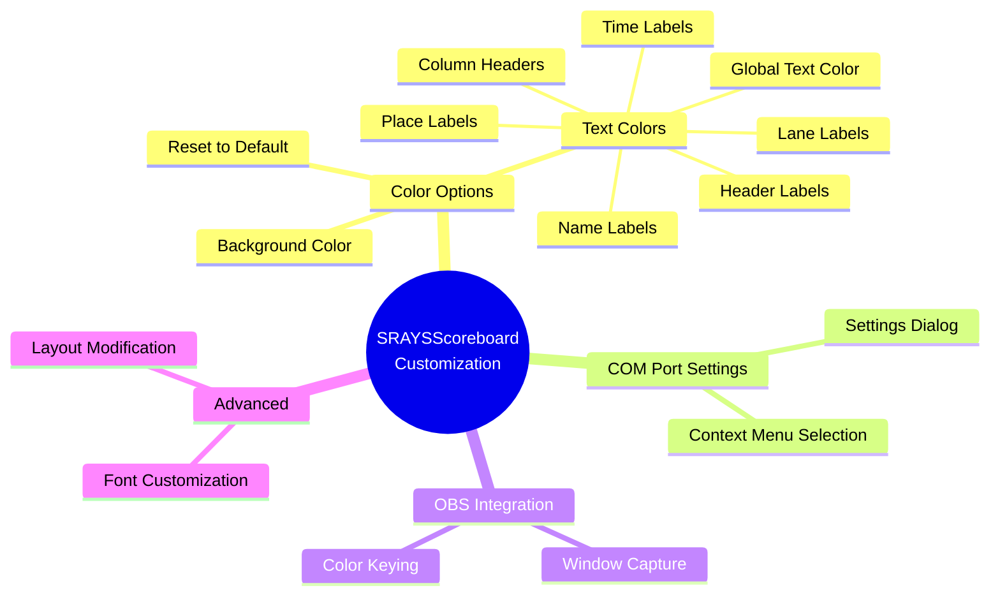

# SRAYSScoreboard Customization Guide

This document provides detailed information on how to customize the appearance and behavior of the SRAYSScoreboard application.

The diagram above shows the various customization options available in SRAYSScoreboard.

## Color Customization

SRAYSScoreboard offers extensive color customization options through its context menu. Right-click anywhere on the scoreboard to access these options.

### Background Color

You can change the background color of the entire scoreboard:

1. Right-click on the scoreboard
2. Select "Colors" > "Background Color"
3. Choose your desired color from the color picker
4. Click "OK" to apply the change

### Text Color Options

#### Global Text Color

To change all text elements to the same color:

1. Right-click on the scoreboard
2. Select "Colors" > "Text Color (All)"
3. Choose your desired color from the color picker
4. Click "OK" to apply the change

#### Individual Element Colors

For more granular control, you can customize the color of specific elements:

1. Right-click on the scoreboard
2. Select "Colors" and then choose one of the following options:
   - "Header Labels Color" - Changes the color of the event name and running time
   - "Column Headers Color" - Changes the color of the column titles (Lane, Name, Place, Time)
   - "Name Labels Color" - Changes the color of all swimmer names
   - "Time Labels Color" - Changes the color of all swimmer times
   - "Place Labels Color" - Changes the color of all place indicators
   - "Lane Labels Color" - Changes the color of the lane numbers
3. Choose your desired color from the color picker
4. Click "OK" to apply the change

### Resetting Colors

To reset all colors to their default values:

1. Right-click on the scoreboard
2. Select "Colors" > "Reset to Default Colors"

The default color scheme uses:
- Black background
- Blue header labels and column headers
- Light steel blue for all data (names, times, places, lane numbers)

## COM Port Configuration

You can change the COM port used to connect to the timing system in two ways:

### Using the Context Menu

1. Right-click on the scoreboard
2. Select "COM Port"
3. Choose the desired COM port from the list
4. If your COM port isn't listed, select "Refresh List" to update the available ports

### Using the Settings Dialog

1. Right-click on the scoreboard
2. Select "Settings"
3. Enter the COM port name (e.g., "COM1")
4. Click "OK" to apply the change

## OBS Integration

SRAYSScoreboard includes a dedicated form optimized for capture in Open Broadcaster Software (OBS) or other streaming applications.

### Launching the OBS Scoreboard

The OBS Scoreboard can be launched from the main application. This creates a separate window that can be captured in OBS as a source.

### Customizing the OBS Scoreboard

The OBS Scoreboard inherits the color settings from the main scoreboard. Any changes made to the color scheme in the main application will be reflected in the OBS Scoreboard as well.

The OBS Scoreboard is designed to be:
- Resizable to fit different streaming layouts
- Chromakey-friendly with a customizable background color
- Lightweight to minimize impact on streaming performance

## Advanced Customization

For advanced users who want to further customize the application beyond the built-in options:

### Font Customization

While the application doesn't provide a direct UI for changing fonts, you can modify the font properties in the source code:

1. Open the project in Visual Studio
2. Locate the form designer files (Scoreboard.Designer.cs and OBSScoreboard.Designer.cs)
3. Modify the font properties of the labels
4. Rebuild the application

### Layout Customization

The layout of the scoreboard is defined using a TableLayoutPanel. Advanced users can modify this layout:

1. Open the project in Visual Studio
2. Use the Windows Forms Designer to adjust the layout
3. Rebuild the application

## Saving and Loading Configurations

All customization settings are automatically saved when you make changes and will be restored the next time you launch the application. The settings are stored in the application's user settings file.

## Troubleshooting Customization Issues

### Colors Not Saving

If your color settings aren't being saved between sessions:
- Ensure you have write permissions to the application's settings directory
- Try running the application as administrator

### COM Port Connection Issues

If you're having trouble connecting to the timing system:
- Verify that the COM port is correctly installed and recognized by Windows
- Ensure you are using the correct custom DB9 cable with RS-485 protocol (not RS-232)
  
  **PC Side (DB9 Female):**
  | DB9 Pin | Function      |
  |---------|---------------|
  | 1       | T(+) / RS-485 B(+) |
  | 2       | T(-) / RS-485 A(-) |
  | 5       | Ground        |
  | 3,4,6,7,8,9 | Not connected |
  
  **ARES Timing Console Side (DB9 Male):**
  | DB9 Pin | Function      |
  |---------|---------------|
  | 3       | T(-) / RS-485 A(-) |
  | 4       | T(+) / RS-485 B(+) |
  | 7       | Ground        |
  | 1,2,5,6,8,9 | Not connected |

- Check that no other application is using the same COM port
- Ensure the timing system is properly configured to output in Venus ERTD format
- If using a USB adapter, ensure it is specifically a USB 2.0 to RS-485 adapter (standard USB-to-Serial adapters that only support RS-232 will not work)
- Try using a different USB port if connection issues persist
- If making your own cable, ensure the wiring connects T(+) to T(+) and T(-) to T(-) between the two ends
