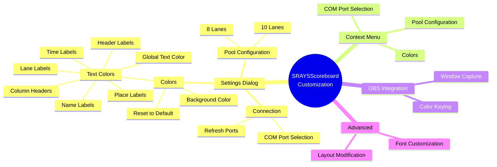

# SRAYSScoreboard Customization Guide

This document provides detailed information on how to customize the appearance and behavior of the SRAYSScoreboard application.



The diagram above shows the various customization options available in SRAYSScoreboard.

## Settings Dialog

SRAYSScoreboard features a comprehensive settings dialog that provides a centralized interface for all customization options. You can access this dialog in two ways:

1. Press the F2 key while the scoreboard is active
2. Right-click on the scoreboard and select "Settings" from the context menu

The settings dialog is organized into three tabs:

### Connection Tab
Configure the COM port used to connect to the timing system:
- Select the COM port from the dropdown list
- COM5 is automatically recommended as the default timing system port
- Click "Refresh" to update the list of available ports
- Click "OK" to apply the changes

### Colors Tab
Customize the colors of various scoreboard elements:
- Background Color - Changes the background color of the entire scoreboard
- Text Color (All) - Changes all text elements to the same color
- Header Labels Color - Changes the color of the event name and running time
- Column Headers Color - Changes the color of the column titles (Lane, Name, Place, Time)
- Name Labels Color - Changes the color of all swimmer names
- Time Labels Color - Changes the color of all swimmer times
- Place Labels Color - Changes the color of all place indicators
- Lane Labels Color - Changes the color of the lane numbers
- Reset Colors - Resets all colors to their default values

### Pool Configuration Tab
Configure the number of lanes displayed on the scoreboard:
- 8 Lanes - Displays lanes 1-8 only
- 10 Lanes - Displays all 10 lanes

## Context Menu Customization

SRAYSScoreboard also offers customization options through its context menu. Right-click anywhere on the scoreboard to access these options.

### Color Customization

You can change the colors of various scoreboard elements through the context menu:

1. Right-click on the scoreboard
2. Select "Colors" and then choose one of the following options:
   - "Background Color" - Changes the background color of the entire scoreboard
   - "Text Color (All)" - Changes all text elements to the same color
   - "Header Labels Color" - Changes the color of the event name and running time
   - "Column Headers Color" - Changes the color of the column titles (Lane, Name, Place, Time)
   - "Name Labels Color" - Changes the color of all swimmer names
   - "Time Labels Color" - Changes the color of all swimmer times
   - "Place Labels Color" - Changes the color of all place indicators
   - "Lane Labels Color" - Changes the color of the lane numbers
   - "Reset to Default Colors" - Resets all colors to their default values
3. Choose your desired color from the color picker (if applicable)
4. Click "OK" to apply the change

The default color scheme uses:
- Black background
- Blue header labels and column headers
- Light steel blue for all data (names, times, places, lane numbers)

### COM Port Configuration

You can change the COM port used to connect to the timing system through the context menu:

1. Right-click on the scoreboard
2. Select "COM Port"
3. Choose the desired COM port from the list
4. If your COM port isn't listed, select "Refresh List" to update the available ports

### Pool Configuration

You can change the number of lanes displayed on the scoreboard through the context menu:

1. Right-click on the scoreboard
2. Select "Pool Configuration"
3. Choose either "8 Lanes" or "10 Lanes"

## OBS Integration

SRAYSScoreboard includes a dedicated form optimized for capture in Open Broadcaster Software (OBS) or other streaming applications.

### Launching the OBS Scoreboard

The OBS Scoreboard can be launched from the main application. This creates a separate window that can be captured in OBS as a source.

### Customizing the OBS Scoreboard

The OBS Scoreboard inherits all settings from the main scoreboard, including:
- Color settings (background, text, and individual element colors)
- Pool configuration (8 or 10 lanes)

Any changes made to these settings in the main application will be automatically reflected in the OBS Scoreboard.

The OBS Scoreboard is designed to be:
- Resizable to fit different streaming layouts
- Chromakey-friendly with a customizable background color
- Lightweight to minimize impact on streaming performance

## Advanced Customization

For advanced users who want to further customize the application beyond the built-in options:

### Font Customization

While the application doesn't provide a direct UI for changing fonts, you can modify the font properties in the source code:

1. Open the project in Visual Studio
2. Locate the form designer files (Scoreboard.Designer.cs and OBSScoreboard.Designer.cs)
3. Modify the font properties of the labels
4. Rebuild the application

### Layout Customization

The layout of the scoreboard is defined using a TableLayoutPanel. Advanced users can modify this layout:

1. Open the project in Visual Studio
2. Use the Windows Forms Designer to adjust the layout
3. Rebuild the application

## Saving and Loading Configurations

All customization settings are automatically saved when you make changes and will be restored the next time you launch the application. The settings are stored in the application's user settings file.

## Troubleshooting Customization Issues

### Colors Not Saving

If your color settings aren't being saved between sessions:
- Ensure you have write permissions to the application's settings directory
- Try running the application as administrator

### COM Port Connection Issues

If you're having trouble connecting to the timing system:
- Verify that the COM port is correctly installed and recognized by Windows
- Ensure you are using the correct custom DB9 cable with RS-485 protocol (not RS-232)

  #### DB9 Connector Pin Numbering

  ```mermaid
  graph TB
      subgraph "DB9 Female Connector (PC Side)"
          direction TB
          F1["Pin 1"] --- F2["Pin 2"] --- F3["Pin 3"] --- F4["Pin 4"] --- F5["Pin 5"]
          F6["Pin 6"] --- F7["Pin 7"] --- F8["Pin 8"] --- F9["Pin 9"]
          
          F1 -.- FT1["T(+)/RS-485 B(+)"]
          F2 -.- FT2["T(-)/RS-485 A(-)"]
          F5 -.- FT5["Ground"]
          
          style F1 fill:#bbf,stroke:#33f,stroke-width:2px
          style F2 fill:#fbb,stroke:#f33,stroke-width:2px
          style F5 fill:#bbb,stroke:#333,stroke-width:2px
      end
      
      subgraph "DB9 Male Connector (ARES Side)"
          direction TB
          M1["Pin 1"] --- M2["Pin 2"] --- M3["Pin 3"] --- M4["Pin 4"] --- M5["Pin 5"]
          M6["Pin 6"] --- M7["Pin 7"] --- M8["Pin 8"] --- M9["Pin 9"]
          
          M3 -.- MT3["T(-)/RS-485 A(-)"]
          M4 -.- MT4["T(+)/RS-485 B(+)"]
          M7 -.- MT7["Ground"]
          
          style M3 fill:#fbb,stroke:#f33,stroke-width:2px
          style M4 fill:#bbf,stroke:#33f,stroke-width:2px
          style M7 fill:#bbb,stroke:#333,stroke-width:2px
      end
  ```
  
  **PC Side (DB9 Female):**
  | DB9 Pin | Function      |
  |---------|---------------|
  | 1       | T(+) / RS-485 B(+) |
  | 2       | T(-) / RS-485 A(-) |
  | 5       | Ground        |
  | 3,4,6,7,8,9 | Not connected |
  
  **ARES Timing Console Side (DB9 Male):**
  | DB9 Pin | Function      |
  |---------|---------------|
  | 3       | T(-) / RS-485 A(-) |
  | 4       | T(+) / RS-485 B(+) |
  | 7       | Ground        |
  | 1,2,5,6,8,9 | Not connected |

- Check that no other application is using the same COM port
- Ensure the timing system is properly configured to output in Venus ERTD format
- If using a USB adapter, ensure it is specifically a USB 2.0 to RS-485 adapter (standard USB-to-Serial adapters that only support RS-232 will not work)
- Try using a different USB port if connection issues persist
- If making your own cable, ensure the wiring connects T(+) to T(+) and T(-) to T(-) between the two ends
