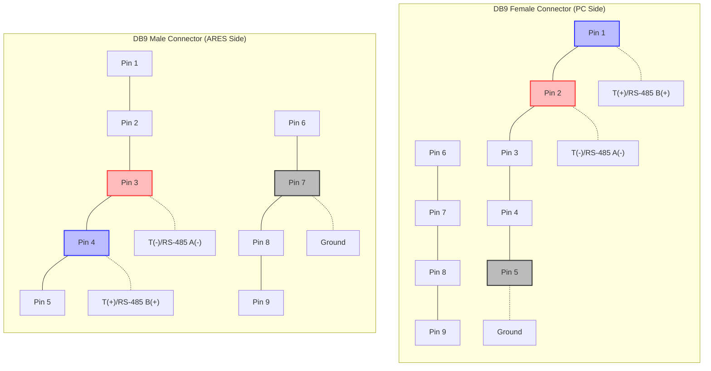
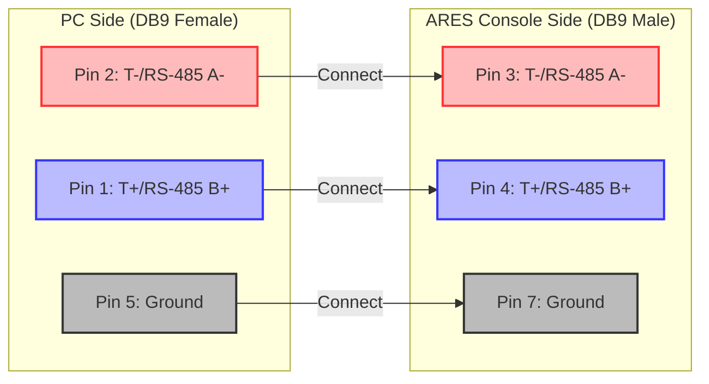

# Venus ERTD Protocol

This document provides a detailed overview of the Venus ERTD protocol used by the Omega ARES 21 timing system and how SRAYSScoreboard processes this data.

## Protocol Overview

The Venus ERTD (Extended Real-Time Data) protocol is used by Omega timing systems to transmit real-time swimming competition data to external display systems. SRAYSScoreboard connects to the timing system via a serial port using the RS-485 protocol and interprets this data to display it in a user-friendly format.

### Physical Connection

The Omega ARES 21 timing system uses RS-485 (not RS-232) for data transmission. A custom DB9 cable with different pinouts on each end is required:

#### DB9 Connector Pin Numbering

For reference, here is the standard DB9 pin numbering:



#### Cable Pinout

**PC Side (DB9 Female):**
| DB9 Pin | Function      |
|---------|---------------|
| 1       | T(+) / RS-485 B(+) |
| 2       | T(-) / RS-485 A(-) |
| 5       | Ground        |
| 3,4,6,7,8,9 | Not connected |

**ARES Timing Console Side (DB9 Male):**
| DB9 Pin | Function      |
|---------|---------------|
| 3       | T(-) / RS-485 A(-) |
| 4       | T(+) / RS-485 B(+) |
| 7       | Ground        |
| 1,2,5,6,8,9 | Not connected |

Note that the cable must be wired to connect T(+) to T(+) and T(-) to T(-), with the appropriate pins on each end. The cable must be custom-made or modified from a standard cable to match this pinout.

#### Cable Wiring Diagram



This diagram shows how to wire the custom cable between the PC and the ARES timing console. Note that the T+ (blue) connects to T+ and T- (red) connects to T-, but they are on different pins on each end of the cable.

The default baud rate for the connection is 9600, with 8 data bits, no parity, and 1 stop bit (9600 8N1).

**Important Note:** If your computer doesn't have a native serial port, you must use a USB 2.0 to RS-485 adapter. Standard USB-to-Serial adapters that only support RS-232 will not work with this protocol.

## Control Characters

The protocol uses the following ASCII control characters to structure the data transmission:

- SOH (Start of Header): ASCII 0x01 - Indicates the beginning of a header section
- STX (Start of Text): ASCII 0x02 - Indicates the beginning of a data section
- EOT (End of Transmission): ASCII 0x04 - Indicates the end of a data transmission

## Message Structure

Each message in the Venus ERTD protocol follows this structure:

```
SOH + [Header Code] + STX + [Data] + EOT
```

Where:
- `[Header Code]` is a 10-digit code that identifies the type of data being transmitted
- `[Data]` is the actual content (event name, time, swimmer information, etc.)

## Header Codes

The application recognizes the following header codes:

### Event Information
- `0040100069` - Event name and number

### Running Time
- `0040100000` - Current running time of the event

### Swimmer Names (by lane)
- Lane 1: `0040100200`
- Lane 2: `0040100236`
- Lane 3: `0040100272`
- Lane 4: `0040100308`
- Lane 5: `0040100344`
- Lane 6: `0040100380`
- Lane 7: `0040100416`
- Lane 8: `0040100452`
- Lane 9: `0040100488`
- Lane 10: `0040100524`

### Results (place and time by lane)
- Lane 1: `0040100220`
- Lane 2: `0040100256`
- Lane 3: `0040100292`
- Lane 4: `0040100328`
- Lane 5: `0040100364`
- Lane 6: `0040100400`
- Lane 7: `0040100436`
- Lane 8: `0040100472`
- Lane 9: `0040100508`
- Lane 10: `0040100544`

## Data Processing Flow

1. The application reads data from the serial port character by character
2. It maintains state variables to track whether it's currently processing a header or data section
3. When a complete message is received (after an EOT character), it processes the data based on the header code
4. The processed data is stored in the `AresDataHandler` class and used to update the display

## Example Data Packets

### Event Information
```
SOH + 0040100069 + STX + Event 12: Men's 100m Freestyle + EOT
```

### Running Time
```
SOH + 0040100000 + STX + 01:23.45 + EOT
```

### Swimmer Name
```
SOH + 0040100200 + STX + John Smith + EOT
```

### Result Data
```
SOH + 0040100220 + STX + 1 00:54.32 + EOT
```

## Troubleshooting

### Common Protocol Issues

1. **Missing or Corrupted Data**: If the timing system sends incomplete or corrupted data, the application may not display all information correctly. Check the physical connection and ensure the timing system is configured properly.

2. **Incorrect Header Codes**: If the timing system is using different header codes than expected, the application won't recognize the data. Verify that the ARES system is set to Venus ERTD scoreboard format.

3. **Timing Issues**: If data appears to be delayed or out of sync, check the baud rate and other serial port settings to ensure they match the timing system's configuration.

## Implementation Details

For the complete implementation of the protocol parser, see the `AresDataHandler.cs` file in the source code. This class contains methods for processing input characters, parsing swimmer names and results, and storing the processed data for display.

The main processing occurs in the `processInput` method, which implements a state machine to track the current position in the protocol and process the data accordingly.
