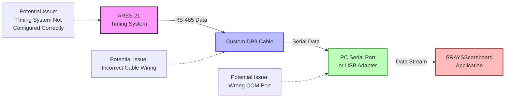

# SRAYSScoreboard Troubleshooting Guide

This document provides solutions for common issues you might encounter when using SRAYSScoreboard.

## Connection Issues



The diagram above shows the data flow from the timing system to the application and potential points of failure.

### No Connection to Timing System

**Symptoms:**
- "COM port not found" message
- No data appears on the scoreboard
- Application starts but doesn't display any event information

**Solutions:**
1. **Check Physical Connection**
   - Ensure the serial cable is securely connected to both the computer and the timing system
   - Verify you are using the correct custom DB9 cable with RS-485 protocol (not RS-232)
   
     #### DB9 Connector Pin Numbering

     ```mermaid
     graph TB
         subgraph "DB9 Female Connector (PC Side)"
             direction TB
             F1["Pin 1"] --- F2["Pin 2"] --- F3["Pin 3"] --- F4["Pin 4"] --- F5["Pin 5"]
             F6["Pin 6"] --- F7["Pin 7"] --- F8["Pin 8"] --- F9["Pin 9"]
             
             F1 -.- FT1["T(+)/RS-485 B(+)"]
             F2 -.- FT2["T(-)/RS-485 A(-)"]
             F5 -.- FT5["Ground"]
             
             style F1 fill:#bbf,stroke:#33f,stroke-width:2px
             style F2 fill:#fbb,stroke:#f33,stroke-width:2px
             style F5 fill:#bbb,stroke:#333,stroke-width:2px
         end
         
         subgraph "DB9 Male Connector (ARES Side)"
             direction TB
             M1["Pin 1"] --- M2["Pin 2"] --- M3["Pin 3"] --- M4["Pin 4"] --- M5["Pin 5"]
             M6["Pin 6"] --- M7["Pin 7"] --- M8["Pin 8"] --- M9["Pin 9"]
             
             M3 -.- MT3["T(-)/RS-485 A(-)"]
             M4 -.- MT4["T(+)/RS-485 B(+)"]
             M7 -.- MT7["Ground"]
             
             style M3 fill:#fbb,stroke:#f33,stroke-width:2px
             style M4 fill:#bbf,stroke:#33f,stroke-width:2px
             style M7 fill:#bbb,stroke:#333,stroke-width:2px
         end
     ```
     
     **PC Side (DB9 Female):**
     | DB9 Pin | Function      |
     |---------|---------------|
     | 1       | T(+) / RS-485 B(+) |
     | 2       | T(-) / RS-485 A(-) |
     | 5       | Ground        |
     | 3,4,6,7,8,9 | Not connected |
     
     **ARES Timing Console Side (DB9 Male):**
     | DB9 Pin | Function      |
     |---------|---------------|
     | 3       | T(-) / RS-485 A(-) |
     | 4       | T(+) / RS-485 B(+) |
     | 7       | Ground        |
     | 1,2,5,6,8,9 | Not connected |
   
   - If using a USB adapter, ensure it is a USB 2.0 to RS-485 adapter (standard USB-to-Serial adapters that only support RS-232 will not work)
   - Try a different USB port if connection issues persist
   - Try a different serial cable if available
   - Check for any damaged pins in the DB9 connectors on both ends

2. **Verify COM Port Settings**
   - Open the Settings dialog by pressing F2 or right-clicking and selecting "Settings"
   - In the Connection tab, select the correct COM port from the dropdown list
   - Note that COM5 is automatically recommended as the default timing system port
   - Click "Refresh" to update the list of available ports
   - Check Windows Device Manager to confirm the COM port is properly installed

3. **Check Timing System Configuration**
   - Verify the ARES system is set to output in Venus ERTD scoreboard format
   - Check the baud rate settings on the timing system (default is 9600)
   - Ensure the timing system is actually sending data

4. **Restart Components**
   - Close and reopen SRAYSScoreboard
   - Restart the timing system
   - In some cases, restarting the computer may help

### Intermittent Connection

**Symptoms:**
- Data appears and disappears randomly
- Connection drops during events

**Solutions:**
1. **Check for Interference**
   - Move the serial cable away from power sources or other electronic equipment
   - Use a shielded serial cable if possible

2. **Verify Cable Quality**
   - Replace the serial cable with a higher quality one
   - Ensure the cable is not damaged or kinked

3. **Check USB Power Management**
   - If using a USB-to-Serial adapter, disable USB power saving in Windows:
     - Open Device Manager
     - Expand "Universal Serial Bus controllers"
     - Right-click on each USB Root Hub
     - Select "Properties" > "Power Management"
     - Uncheck "Allow the computer to turn off this device to save power"

## Display Issues

### Incorrect or Missing Data

**Symptoms:**
- Swimmer names or times not displaying correctly
- Event information missing or garbled
- Lanes showing incorrect data

**Solutions:**
1. **Check Protocol Format**
   - Ensure the timing system is using the correct protocol format (Venus ERTD)
   - Verify the header codes being sent match those expected by the application

2. **Check Character Encoding**
   - If swimmer names contain special characters, ensure the timing system is using the correct character encoding

3. **Verify Data Source**
   - Confirm that the timing system is properly configured with the correct event and swimmer information

4. **Check Pool Lane Configuration**
   - Open the Settings dialog by pressing F2
   - Go to the Pool Configuration tab
   - Ensure the correct number of lanes (8 or 10) is selected for your pool

### UI Display Problems

**Symptoms:**
- Text overlapping or cut off
- Colors not displaying correctly
- Window sizing issues

**Solutions:**
1. **Reset Color Settings**
   - Open the Settings dialog by pressing F2
   - Go to the Colors tab
   - Click "Reset Colors" to restore default colors
   - Alternatively, right-click on the scoreboard and select "Colors" > "Reset to Default Colors"

2. **Check Display Resolution**
   - Ensure your display resolution is at least 1024x768
   - Try resizing the window if text appears cut off

3. **Font Scaling Issues**
   - If using Windows display scaling, try setting the application to override high DPI scaling:
     - Right-click on the SRAYSScoreboard.exe file
     - Select "Properties" > "Compatibility" > "Change high DPI settings"
     - Check "Override high DPI scaling behavior"
     - Select "System (Enhanced)" from the dropdown

## OBS Integration Issues

### Capture Problems

**Symptoms:**
- OBS not capturing the scoreboard window
- Black screen in OBS when trying to capture

**Solutions:**
1. **Use Window Capture**
   - In OBS, use "Window Capture" instead of "Game Capture"
   - Select the "OBSScoreboard" window from the dropdown

2. **Try Display Capture**
   - If Window Capture doesn't work, try using "Display Capture" instead
   - Position the OBS Scoreboard window where it can be captured

3. **Check Graphics Settings**
   - If using a laptop with dual graphics (integrated and discrete), make sure OBS is using the same GPU as the scoreboard application

### Color Keying Issues

**Symptoms:**
- Unable to properly chroma key the background
- Background color bleeding into text

**Solutions:**
1. **Optimize Background Color**
   - Open the Settings dialog by pressing F2
   - Go to the Colors tab
   - Click "Background Color" and choose a solid color that doesn't appear in any text (bright green or blue works well)
   - Click "OK" to apply the change

2. **Adjust OBS Chroma Key Settings**
   - In OBS, add a "Chroma Key" filter to the scoreboard source
   - Fine-tune the similarity, smoothness, and key color spill reduction settings
   - Use the preview to check the results

## Settings Dialog Issues

### Settings Not Saving

**Symptoms:**
- Settings revert to previous values after restart
- Changes made in the Settings dialog don't persist

**Solutions:**
1. **Check Permissions**
   - Ensure you have write permissions to the application's settings directory
   - Try running the application as administrator

2. **Verify Dialog Closure**
   - Make sure you're clicking "OK" to save settings, not "Cancel"
   - The settings are only saved when you click "OK"

3. **Check for File Corruption**
   - If settings persistently fail to save, try resetting the application:
     - Close the application
     - Navigate to %APPDATA%\SRAYSScoreboard
     - Rename or delete the user.config file
     - Restart the application (this will create a new settings file with defaults)

## Performance Issues

### High CPU Usage

**Symptoms:**
- Computer running slowly when scoreboard is active
- Fan running at high speed
- Other applications becoming unresponsive

**Solutions:**
1. **Close Unnecessary Applications**
   - Close other applications running in the background
   - Especially close other applications that might be using the same COM port

2. **Check for Infinite Loops**
   - If the application seems to be in an infinite loop processing data, restart it
   - This could happen if corrupted data is received from the timing system

3. **Update Drivers**
   - Ensure your serial port or USB-to-Serial adapter drivers are up to date

### Memory Leaks

**Symptoms:**
- Application uses more and more memory over time
- Performance degrades the longer the application runs

**Solutions:**
1. **Restart Periodically**
   - For long events, consider restarting the application during breaks
   - This will clear any accumulated memory issues

2. **Update to Latest Version**
   - Check for updates to the application that might fix memory leak issues

## Application Crashes

### Unexpected Shutdowns

**Symptoms:**
- Application closes without warning
- Error messages appear before closing

**Solutions:**
1. **Check Event Viewer**
   - Open Windows Event Viewer and check for application errors
   - Look for entries related to SRAYSScoreboard

2. **Run as Administrator**
   - Right-click on the SRAYSScoreboard.exe file
   - Select "Run as administrator"

3. **Check .NET Framework**
   - Ensure you have .NET Framework 4.7.2 or higher installed
   - Repair or reinstall .NET Framework if necessary

4. **Reinstall Application**
   - Uninstall the application
   - Download a fresh copy from the releases page
   - Install it again

## Reporting Issues

If you encounter an issue that isn't covered in this guide:

1. **Gather Information**
   - Note the exact steps that led to the issue
   - Record any error messages that appeared
   - Note your system specifications (Windows version, .NET version, etc.)
   - If possible, take screenshots of the issue

2. **Check for Known Issues**
   - Visit the GitHub repository's Issues page to see if your issue has already been reported

3. **Submit an Issue**
   - If your issue is new, create a new issue on the GitHub repository
   - Include all the information you gathered
   - Be as specific as possible to help the developers reproduce and fix the issue
